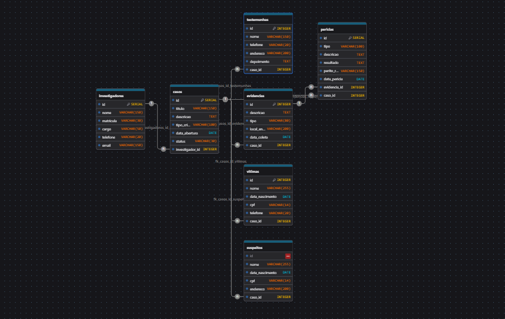

Sistema de Investigação Policial

Projeto desenvolvido para a Atividade Integrada de Banco de Dados com Python.

Sobre o projeto

O projeto consiste na criação de um banco de dados voltado para o gerenciamento de informações de investigações policiais.

A ideia é organizar os dados de investigadores, casos, suspeitos, vítimas, evidências, testemunhas e perícias, permitindo consultar e relacionar essas informações de forma organizada.

Objetivo

Aplicar na prática os conteúdos estudados nas disciplinas de Banco de Dados e Programação Web Backend, utilizando PostgreSQL e Python para desenvolver o projeto.

Banco de Dados

O banco de dados foi planejado utilizando um Diagrama Entidade-Relacionamento (DER) e possui 7 tabelas:

Investigadores
Casos
Suspeitos
Vítimas
Evidências
Testemunhas
Perícias

As tabelas utilizam chaves primárias e estrangeiras para estabelecer os relacionamentos entre os dados.

SQL

Durante o desenvolvimento serão utilizados os principais comandos trabalhados em aula:

CREATE TABLE
INSERT
UPDATE
DELETE
SELECT
WHERE
JOIN

Também serão criadas consultas para obter informações relevantes dos casos e seus respectivos envolvidos.

Python

A parte em Python será desenvolvida utilizando os conceitos estudados em sala:

Funções
Listas
Dicionários
Estruturas de decisão
Estruturas de repetição
Módulos
SQLite com Python

O objetivo é utilizar Python para trabalhar com os dados e desenvolver as funcionalidades propostas para o projeto.

Ferramentas utilizadas
Python
PostgreSQL
SQL
DrawDB
Visual Studio Code
GitHub

Atividade

A atividade tem como objetivo avaliar os conhecimentos adquiridos nas disciplinas de Banco de Dados e Python, colocando em prática a criação e organização de um banco de dados, manipulação de informações com SQL e desenvolvimento utilizando Python.

Integrantes do Projeto
Nome: Kael Andrade
Nome: Murillo Caliel
Nome: Nicolas de Campos

## Diagrama do Banco de Dados

